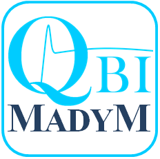

# madym_cxx

Madym is a C++ toolkit for quantative DCE-MRI analysis developed in the [QBI Lab](http://qbi-lab.org/) at the University of Manchester. It comprises a set of command line tools and a graphical user-interface based on an extendable C++ library. It is cross-platform, and requires few external libraries to build from source. Pre-built binaries for Windows, MacOS and Linux are available on request. We have also developed complementary interfaces in python and Matlab, that allow the flexibility of developing in those scripting languages, while allowing C++ to do the heavy-duty computational work of tracer-kinetic model fitting.

See the [project wiki](https://gitlab.com/manchester_qbi/manchester_qbi_public/madym_cxx/-/wikis/home) for full documentation.

# Installation instructions - building from source

## 1. External dependencies
To build from source, Madym requires the following:

1. A C++ compiler that fully supports C++14
2. CMake to configure and generate project files
3. The `filesystem`, `system`, `program_options`, `date_time` and `test` libraries from Boost
4. (Optional) Qt5 - required to build the Madym-GUI, but not required for the main C++ library or command line tools
5. (Optional) zlib - required to support compressed NIFTI format (*.nii.gz), standard uncompressed NIFTI images can be used without zlib
6. (Optional) DCMTK - required to build the DICOM conversion tool
7. (Optional) Doxygen to build documentation from source code comment tags

## TL;DR instructions
If you're used to configuring and building C++ projects with CMake, Madym should be pretty easy to install. Assuming you have the above pre-requisites built and installed:
+ Go the root directory of the madym_cxx repository you have just cloned, there is a CMakeLists.txt file in this directrory, so this is the head of the source tree. We strongly recommend building your binaries outside of the source tree.
+ Run CMake to confiure and generate project files
    - If you want to build the Madym-GUI, switch *BUILD_QT_GUI* to *ON*. You may then need to set *Qt* fields if they are not found automatically by CMake
    - If you want to build with zlib, switch *BUILD_WITH_ZLIB* to *ON*. You may then need to set the location of your installed zlib libraries
    - If you want to build the DICOM conversion tool, switch *BUILD_WITH_DCMTK" to *ON*. You may need to set the location of your installed DCMTK libraries
    - If you want to build your own documentation with Doxygen, set *BUILD_DOCUMENTATION* to on
 + Build the project. If you selected to build documentation, this will only be built for release configurations.
 + Run testing using Ctest. Everything should pass, if there are any errors, see notes on Tests below.

 ## Detailed Instructions

#### C++ compiler
Madym has mainly been developed on Windows using Visual Studio 2017 (compiler version msvc-14.0). However it has also been built and tested using [GCC 6.30](https://www.gnu.org/software/gcc/gcc-6/) (Linux) and [LLVM/Clang](https://clang.llvm.org/) (MacOs). Any compilers *at least as* modern as those that support C++14 should be fine.

#### CMake
Madym requires [CMake 3.10](https://cmake.org/download/) or above.

#### Boost
On Linux/MacOS you should be able to install Boost simple using *apt-get* or *brew install*. Any version of Boost &ge;1.60 should be ok, however it is important that whatever Boost you link to has been built with at least as modern a compiler as you are using to build Madym. Madym may build against incompatible Boost libraries, but will not work properly at runtime. Any problems should be picked up during initial tests (see notes below).

For Windows (or if for any reason simply installing on Linux/MacOS doesn't work), it is best to build boost from source. To do so, follow the instructions at [https://www.boost.org](https://www.boost.org/doc/libs/1_62_0/more/getting_started/windows.html).

The tricky bit here is making sure you configure the build settings (achieved using boosts own `bootstrap` script (`.bat` for Windows, `.sh` for *nix)) to use the correct compiler.

Open a developer terminal (this ports with VS and is essentially a Windows command terminal, with the environment pre-set for your Visual Studio version – start typing “developer” at the Windows toolbar search box and Developer Command Prompt for Visual Studio should be the first app that appears).

CD into the top level boost folder you’ve just downloaded. Run 
    `bootstrap `

If this works you should get a message about Building the Boost.Build engine, and then a message saying bootstrapping is done.

Now call `b2` to build the filesystem, system and program_option libraries, setting the following options:
1. `--toolset=msvc-14.0` this tells boost to use correct compiler (this assumes using Visual Studio 2015, see eg [here](https://en.wikipedia.org/wiki/Microsoft_Visual_C%2B%2B#Internal_version_numbering) for a list of other versions)
2. `address-model=64` this makes sure we build 64-bit binaries
3. `--build-type=complete` tells boost to build both debug and release versions (if you know you only want one, you can put Debug or Release instead of complete
4. `--with-filesystem`, `--with-system`, `--with-program_options`, `--with-test`, `--with-date_time`. These options aren’t essential, but will save *lots* of time and disk space compared to building all the libraries, which is the default if individual libraries are not specified.

So the final command should look like:

    b2 --toolset=msvc-14.0 address-model=64 --build-type=complete --with-filesystem --with-system --with-program_options --with-test --with-date_time

If all has been successful the libraries will have been built into **<Boost_DIR>stage\lib**. Make a note of the location of these files as you may need to manually add to CMake to configure Madym.

#### Qt
Qt is only required if you would like to build Madym's GUI tool, that acts as a user-friendly front-end to configure and run the main tools. If you just want to build the main Madym C++ library and command line tools, Qt is not required. To download Qt, use the open source installer for Qt-5, available [here](https://www.qt.io/download-open-source?hsCtaTracking=9f6a2170-a938-42df-a8e2-a9f0b1d6cdce%7C6cb0de4f-9bb5-4778-ab02-bfb62735f3e5).

#### Zlib
Zlib is required to support compressed NIFTI format (*.nii.gz) images. On linux/MacOS zlib can be installed via apt-get/brew, however on any platform it simple to build from source, which can be downloaded from [here](https://zlib.net/). The root folder of the source directory contains a CMakeLists.txt file, and the default configure, generate and build steps should work with no modification required.

#### DCMTK
DCMTK is required to build the command-line tool for sorting and converting DICOM data into NIFTI/Analyze images. Options for installing from binaries are given [here](https://dicom.offis.de/dcmtk.php.en). It can also be built from source, which can be downloaded [here](https://github.com/DCMTK/dcmtk). If building from source, the root directory has a CMakeLists.txt file, allowing the project files to be built and generated as usual with CMake. If building from source on Windows, note that:
1. DCMTK defaults to building against the [static Windows runtime](https://docs.microsoft.com/en-us/cpp/c-runtime-library/crt-library-features?view=msvc-160) (compiler flags MT/MTd), whereas Madym defaults to building against the dynamic runtime (compiler flags MD/MDd), causing a link error. To avoid this, make sure you set *DCMTK_COMPILE_WIN32_MULTITHREADED_ON* to *ON*, before reconfiguring and generating the project. After setting this option and reconfiguring, you can check the various *CMAKE_CXX_FLAGS* have changed to MD/MDd (note though it is not a good idea to change these manually yourself).
2. DCMTK does not suffix debug libraries by default, thus if you build and install both Debug and Release versions, whichever you build last will overwrite the former in the install location. As a result, when you try to build against the installed library, you may get a mismatched build type error in Visual Studio. To avoid this, set the *CMAKE_DEBUG_POSTFIX* option to a suitable value (*eg* d, you may need to toggle advanced options to on) before genearting and building the Debug libraries.

If building from source on Linux/MacOS, DCMTK deafults to static builds, therefore to make compatible with a dynamic build (the default for Madym on Linux/MacOS), set *BUILD_SHARED_LIBS=ON*. 

## 2. Configuring Madym
Once the external dependencies are installed, Madym should be pretty quick and simple to configure and build, using the following steps:

1. Create a directory for your binary files, we strongly recommend *out-of-source* builds, *ie* create your binary directory outside of the source directory.

### Windows
2. Open the CMake GUI, set *Where is the source code* to the **madym_cxx** repository you have just cloned, and *Where to build the binaries* to the binary directory you have just created.
3. Click configure, and select the compiler (*eg* Visual Studio 14 2015 Win64) from the list of available compilers.
4. After running compiler checks, an error should return as it won't be able to find Boost (if you built Boost from source). 
    * Tick the Advanced checkbox to see the Boost fields. Don't worry about setting *Boost_DIR* but set the paths to the debug/release versions of the filesystem, system, program_options and unit-test libraries and *Boost_INCLUDE_DIR* to the root boost directory (which should contain a directory *boost*, in which the source code headers for each libraries are contained)
5. Click configure again, and this time no errors should be returned. Click Generate to make the project files.

### Linux/MacOS

2. CD into the binary directory you have just created. Call CCMake with the path to your source code to start CMake's interactive configurer (*eg* **ccmake <path_to_source>**), then press **c** to configure. Once the CMake cache has been generated, future calls to Cmake can be made from the binary directory just using **ccmake .**. 

3.  After running compiler checks, an error will return if CMake can't find Boost (possible if you built Boost from source). 
    * Press **t** to toggle to advanced mode to see the Boost fields. Don't worry about setting *Boost_DIR* but set the paths to the debug/release versions of the filesystem and system libraries and *Boost_INCLUDE_DIR* to the root boost directory (which should contain a directory *boost*, in which the source code headers for each libraries are contained)
4. Press **c** to configure again, and this time no errors should be returned. Press **g** to generate the project files.

When you have generated CMake project files, check your binary directory. In addition to any project files, there should be two new directories created from the source tree: *calibration_dir* (containing binary files required for testing) and *generated* (containing a version header, that sets various macro definitions required by the project).

#### Additional configuration options
+ To build the GUI, set *BUILD_QT_GUI* to *ON*. You will then need to set the *QtCore_DIR*, *QtGui_DIR* and *QtWidgets_DIR* fields if Qt was not found automatically.
+ To build with support for compressed NIFTI images, set *BUILD_WITH_ZLIB* to *ON*
+ To build the DICOM sort and convert tool, set *BUILD_WITH_DCMTK* to *ON*
+ To build your own class documentation (requires Doxygen), *BUILD_DOCUMENTATION* to *ON*.

## 3. Building Madym
### Windows
Go to the binary directory in a file explorer, and there should be a Visual Studion solution file *manchester_qbi_madym.sln*. Open this solution in Visual Studio. In the solution explorer, right-click **ALL_BUILD** and select **Build**. Repeat as desired for Debug/Release configurations.

Now right click **RUN_TESTS** and select build. This will run the library checks. All tests should pass. If any tests fail, this will return a build error - ignore the build error, but check the output to note which tests have failed. See more under *Testing* [here](library_design). Note the tests will be considerably slower in Debug mode because none of the speed checks used by Alglib are not optimised in debug mode.

### Linux/MacOS
CD to the binary directory, and run **make all**. Then run **ctest** to run the library checks. All tests should pass.

Assuming you've got here and everything has built successfully... great! You're good to go and start doing some DCE analysis. Please see the [project wiki](https://gitlab.com/manchester_qbi/manchester_qbi_public/madym_cxx/-/wikis/home) for detailed instructions on how to use Madym.

## Have fun!

